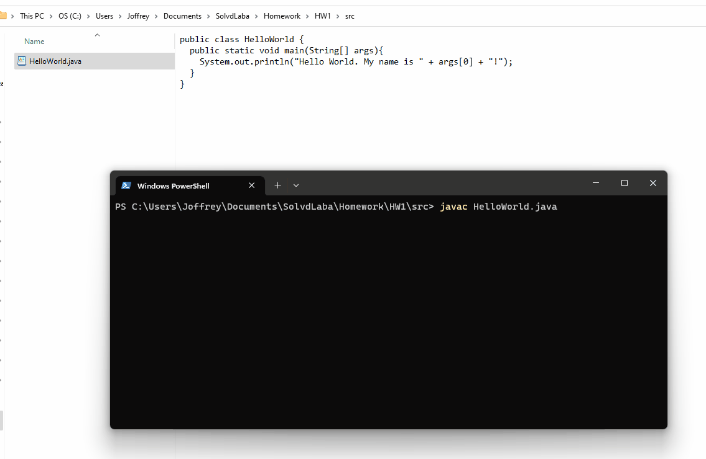

# Task-1

#### [Task 1.1 - System.out app](#task-1.1)

Create a simple system.out app. Print info about the user that should be passed to the main function as a parameter. Compile and run the program from the command line using javac and java from JDK.

#### [Task 1.2 - Sorting Algorithm Implementation](#task-1.2)

Sorting algorithm implementation. Choose any from the list: Insertion sort, Selection sort, bubble sort, Merge sort, Quicksort.

## Task 1.1 - System.out app

This code is a Java program that prints "Hello World. My name is `[value of args[0]]`!" to the console. It takes the first command-line argument and inserts it into the message.
As shown below, the app is first compiled (translates Java source code into bytecode) using the `javac` command and calling the file extension with the name from the JDK which creates a `.class` file upon execution.

`javac HelloWorld.java`

Then, we run the app by using the `java` command with the name of the class (without file extension) and our command line argument. In this case, our name.  
`java HelloWorld Joffrey`
 

## Task 1.2 - Sorting Algorithm Implementation

The `SortMethods` class provides three static methods for sorting integer arrays: `insertionSort`, `selectionSort`, and `bubbleSort`.

##### Insertion Sort

`insertionSort` is a method that implements the insertion sort algorithm where we iterate through each element in the array and insert it into its correct position relative to the other elements.

##### Selection Sort

`selectionSort` is a method that implements the selection sort algorithm where we iterate through the unsorted array to find the smallest element and move(swap) it to the beginning of the sorted part of the array.

##### Bubble Sort

`bubbleSort` is a method that implements the bubble sort algorithm by repeatedly swapping adjacent elements that are in the wrong order. This causes the largest value to bubble up towards its respective position.

##### Testing

This code also includes test cases for each sorting method in the `SortMethodsTest` class. The tests ensure that each sorting method produces the expected output for a variety of inputs. To run the tests, run the SortMethodsTest class.
